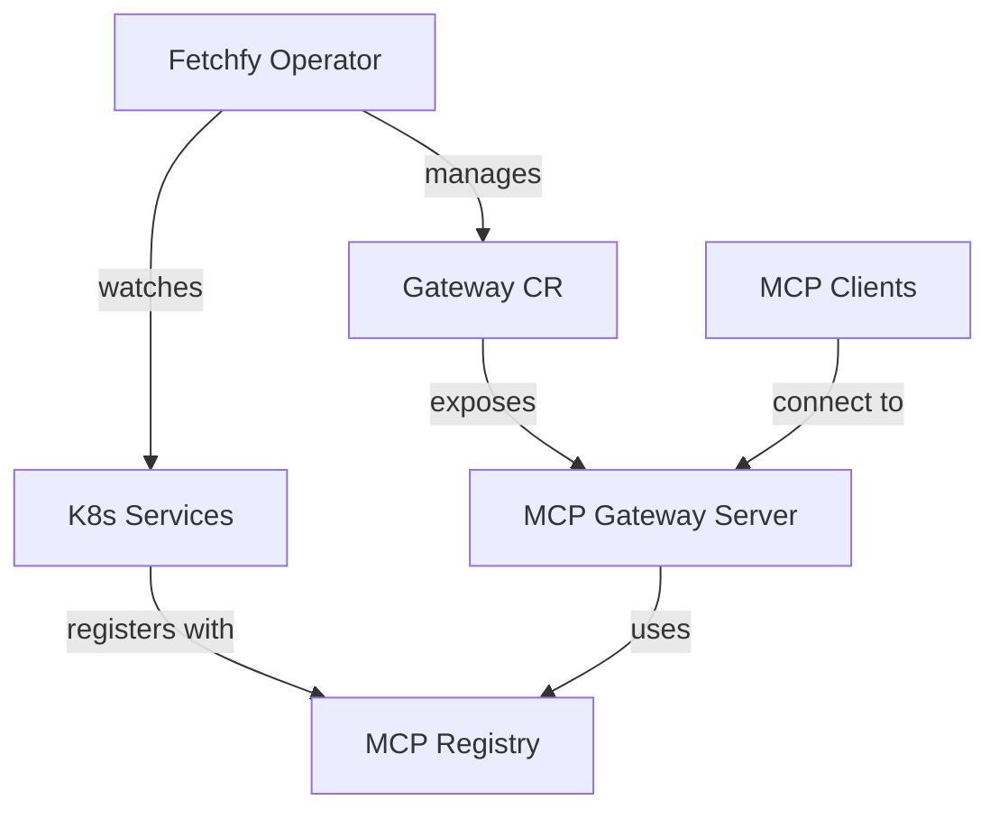
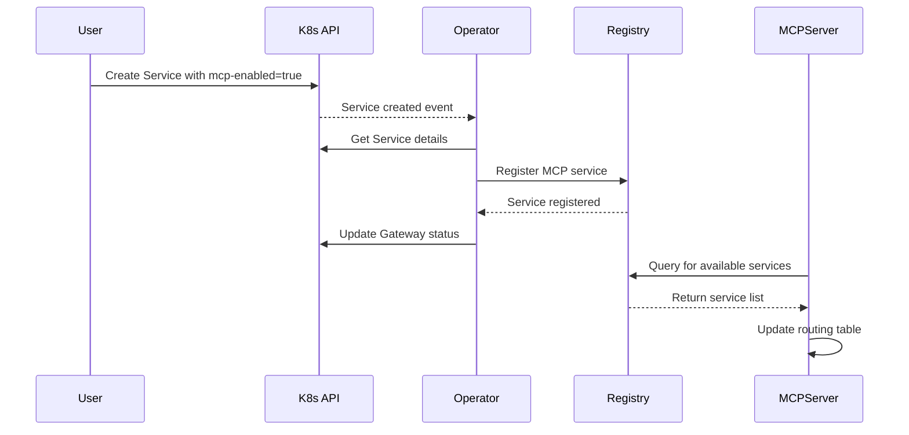

# Architecture

This page describes the architecture of the Fetchfy MCP Gateway Operator and how its components work together to manage MCP services in a Kubernetes cluster.

## High-Level Architecture

The Fetchfy operator follows the Kubernetes Operator pattern and is built using the Operator SDK. It extends Kubernetes with custom resources to manage MCP Gateways and services.



## Core Components

The Fetchfy operator consists of several core components:

### 1. Gateway Controller

The Gateway Controller is responsible for:

- Watching Gateway custom resources
- Creating and managing MCP Gateway servers
- Ensuring the desired state is maintained
- Updating Gateway status with current information

### 2. Service Watcher

The Service Watcher:

- Monitors all Kubernetes Services across namespaces
- Identifies MCP-enabled services based on labels (`mcp-enabled: "true"`)
- Registers/deregisters services with the MCP Registry
- Updates Gateway status with service information

### 3. MCP Registry

The MCP Registry:

- Maintains a list of all MCP services
- Stores metadata about each service (name, namespace, type, endpoint)
- Tracks service status (available, unavailable)
- Provides service discovery capabilities

### 4. MCP Server

The MCP Server:

- Implements the Model Context Protocol
- Exposes MCP endpoints for clients
- Routes requests to appropriate services
- Handles authentication and authorization (when enabled)

## Control Flow

The following diagram illustrates the control flow when a new MCP-enabled service is deployed:



## Custom Resource Definitions

### Gateway CRD

The Gateway custom resource defines an MCP Gateway:

```yaml
apiVersion: fetchfy.ai/v1alpha1
kind: Gateway
metadata:
  name: fetchfy-gateway
spec:
  mcpPort: 8080 # Port for MCP traffic
  serviceSelector: # Selector for MCP services
    matchLabels:
      mcp-enabled: "true"
  enableTls: false # Optional: Enable TLS
  tlsSecretRef: "tls-secret" # Optional: Secret containing TLS certificate
```

The status section of the Gateway provides information about the current state:

```yaml
status:
  address: ":8080" # Address where gateway is available
  mcpServices: # List of registered services
    - name: "mcp-tool-example"
      namespace: "default"
      type: "tool"
      endpoint: "/mcp/tools/example"
      status: "Available"
      lastUpdated: "2025-05-16T10:30:45Z"
  conditions: # Conditions reflecting gateway state
    - type: "Ready"
      status: "True"
      reason: "GatewayReady"
      message: "Gateway is ready with 1 services"
```

## Communication Patterns

### Service Discovery

MCP-enabled services are discovered through Kubernetes service labels. The `mcp-enabled: "true"` label marks a service as MCP-enabled.

Additional metadata is provided through annotations:

- `mcp.fetchfy.ai/type`: "tool" or "agent"
- `mcp.fetchfy.ai/endpoint`: Custom endpoint path for the service

### MCP Protocol Implementation

The MCP Gateway Server implements the Model Context Protocol, which allows:

1. **Function Listing**: Clients can request a list of available functions
2. **Function Invocation**: Clients can invoke functions on specific tools
3. **Agent Execution**: Clients can delegate tasks to agents

The protocol operates over HTTP/HTTPS and uses JSON for data exchange.

## Reconciliation Loop

The operator follows the Kubernetes reconciliation pattern:

1. **Observe**: Watch for changes to Gateways and Services
2. **Analyze**: Determine if the current state matches the desired state
3. **Act**: Take actions to bring the current state closer to the desired state
4. **Inform**: Update status to reflect the current state

This loop ensures that the system is self-healing and eventually consistent.

## Scalability Considerations

The Fetchfy operator is designed to scale with your cluster:

- **Multiple Gateways**: Support for multiple Gateway instances
- **Leader Election**: Ensures only one controller is active in HA deployments
- **Namespace Filtering**: Optional filtering by namespace for large clusters
- **Resource Efficiency**: Minimal resource footprint for the operator
